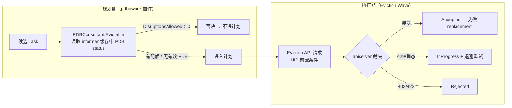
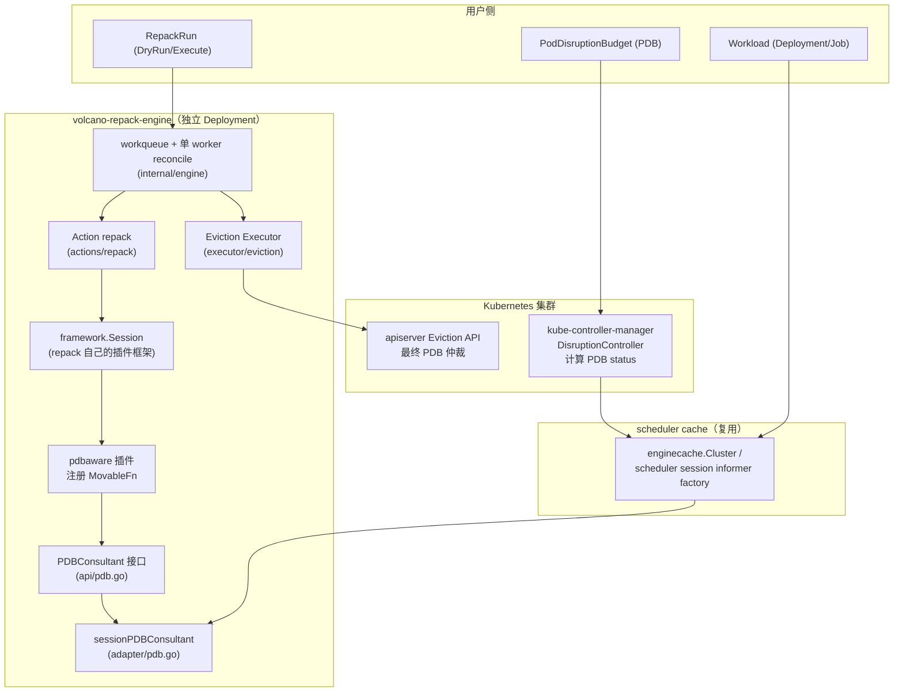
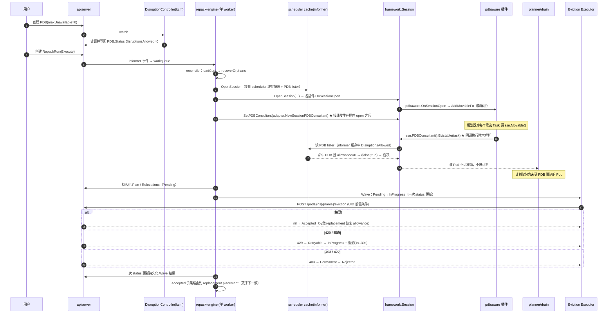
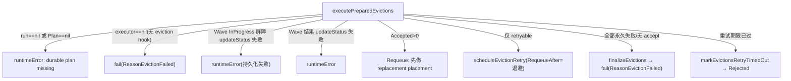

# Volcano Repack Engine PDB 感知（pdbaware）设计文档

> 版本：v1.0　|　日期：2026-08-27　|　分支：`feature_pdbaware_plugin`
> 覆盖范围：规划期 PDB 过滤插件（`pdbaware`）+ 执行期 Eviction Wave 重试机制（既有）+ 对应单元/E2E 测试。

---

## 一、背景与目标

### 1.1 背景

Volcano 提供独立的 **repack 引擎**（`volcano-repack-engine`，对应 `RepackRun` 资源）做集群运行时碎片整理（GPU/NPU 加速器容量整合）。用户在集群中通过 Kubernetes 原生 **PodDisruptionBudget（PDB）** 约束"同一时刻最多有多少 Pod 可以被驱逐"。

引擎规划阶段（Planning）在产生 victim 计划时，**原本不感知 PDB**：

- 被 PDB 完全挡住（`DisruptionsAllowed == 0`）的 Pod 仍会被选为 victim 进入计划；
- 执行阶段（Execute）这些 Pod 的 Eviction API 请求被 apiserver 以 `403` 拒绝，进入内存退避重试，直到 `--repack-eviction-retry-timeout`（默认 10 分钟）耗尽才标记 `Rejected`；
- 当**所有**候选 Pod 都被 PDB 挡住时，引擎会做一整轮"无效规划 + 无效驱逐 + 长时间重试"，最终才收敛——浪费规划/执行资源，收敛慢，且 `RepackRun.status` 被无效中间态频繁扰动。

此外，由于 repack 引擎与 volcano-scheduler 是两个独立组件，调度器侧的 `pkg/scheduler/plugins/pdb` 插件（作用于 reclaim/preempt/shuffle 的 victim 过滤）**并不会**影响 repack 的规划。

### 1.2 目标

> **一句话概括：在 repack 规划阶段就排除"PDB 禁止迁移"的 Pod，使其永不进入计划、永不发起驱逐，同时保持 Eviction API 作为执行期的最终 PDB 仲裁者。**

达到的效果：

- PDB-blocked 的 Pod 从源头不进计划（`Plan.Moves` / `Status.Relocations` 中不出现）；
- 未受 PDB 限制的工作负载正常迁移、正常腾空节点；
- 全 PDB-blocked 场景直接收敛为"无计划"，零驱逐、零无效重试；
- 无 PDB 的集群行为与旧版本完全一致（回归安全）。

---

## 二、整体设计思路

### 2.1 设计决策：双层模型

PDB 的判定天然分两个时点，本功能采用 **"规划期软过滤 + 执行期硬仲裁"** 双层模型：



- **规划期**（本次新增）：`pdbaware` 插件注册 `MovableFn`，对每个候选 Task 调用 `PDBConsultant.Evictable()`，只要其命中的任一 PDB `DisruptionsAllowed <= 0` 就否决，**不解析 PDB selector、不预估配额**——只消费 disruption controller 已经算好的 `Status.DisruptionsAllowed`。
- **执行期**（既有 Wave 机制）：Eviction API 始终是最终 PDB 仲裁者。`429` 等瞬态结果保持 `InProgress` 退避重试，`Accepted` 子集先完成 replacement placement（恢复 PDB allowance）再进入下一波；`403` 等永久失败标记 `Rejected`。PDB 永不绕过。

### 2.2 备选方案对比

| 方案 | 描述 | 优点 | 缺点 | 结论 |
|---|---|---|---|---|
| **A：维持现状** | 规划期完全不感知 PDB，全靠执行期重试 | 实现简单、无新增代码 | 无效规划、无效驱逐重试、全挡场景收敛慢、status 频繁扰动 | 拒绝 |
| **B：规划期只读 status（采纳）** | `pdbaware` 只读 controller 算好的 `DisruptionsAllowed`，`ok=false` 语义保证无 PDB 时不否决 | 实现轻、与 controller 无竞态、无 PDB 时行为不变、天然与执行期一致 | 只读快照，无法模拟"同批多个 Pod 共享配额"（由执行期 Eviction API 兜底） | **采纳** |
| **C：规划期自解析 PDB + 预估配额** | 镜像调度器 `pdb` 插件，自己解析 selector、递减 `DisruptionsAllowed` | 可做批量配额模拟 | 与 disruption controller 计算竞态、实现复杂、易误判、与 apiserver 最终裁决可能不一致 | 拒绝 |

关键设计约束（来自 `pkg/repackengine/plugins/pdbaware/pdb_aware.go` 注释）：

> "The Eviction API remains the final PDB arbiter at Execute time (the wave retry is the backstop); this plugin only prevents obviously-blocked Pods from entering a plan in the first place."

### 2.3 系统架构图

`pdbaware` 在 repack 引擎框架中的位置与调用链路（引擎复用 scheduler 的 informer/cache，但插件体系是 repack 自己的 `framework.Session`）：



---

## 三、核心模块与代码设计

### 3.1 Go 分层结构

| 目录 | 职责 | 本次角色 |
|---|---|---|
| `pkg/repackengine/api/` | repack 引擎公共接口/类型 | 新增 `pdb.go`：`PDBConsultant` 接口 |
| `pkg/repackengine/adapter/` | 把 scheduler/外部能力适配成 repack 接口 | 新增 `pdb.go`：`sessionPDBConsultant` |
| `pkg/repackengine/plugins/pdbaware/` | 规划期 PDB 过滤插件 | **新增**：`pdb_aware.go` + 测试 |
| `pkg/repackengine/framework/` | repack 自己的 Session/Plugin 框架 | 修改 `session.go`：`SetPDBConsultant`/`PDBConsultant`/`noopPDBConsultant` |
| `pkg/repackengine/internal/engine/` | 引擎运行时（reconcile、状态机） | 修改 `action_runtime.go`（接线 consultant）；既有 `eviction_reconcile.go`（执行期 Wave） |
| `pkg/repackengine/executor/eviction/` | Eviction API 请求构造/错误归一 | 既有（`executor.go`） |
| `pkg/repackengine/conf/` | 引擎配置/默认插件 | 修改 `config.go`：`DefaultPluginOptions()` 加入 `pdbaware` |
| `pkg/repackengine/metrics/` | Prometheus 指标 | 既有（含 eviction wave/attempt 指标） |
| `cmd/volcano-repack-engine/` | 引擎二进制入口 | 修改 `main.go`（插件注册 blank import）、`app/options/options.go`（flag 描述） |

### 3.2 核心接口与结构体

**① `api.PDBConsultant`（`pkg/repackengine/api/pdb.go`）**

```go
// PDBConsultant answers "may this task be disrupted right now?" at planning
// time, according to the PDB disruption controller's computed status.
type PDBConsultant interface {
    // Evictable reports whether task may currently be disrupted under its
    // PodGroup's PDB. ok=false means the PodGroup has no effective PDB (or the
    // allowance cannot be determined), which never vetoes a move.
    Evictable(task *schedapi.TaskInfo) (evictable bool, ok bool)
}
```

双返回值语义（全插件的灵魂）：

| 返回 | 含义 | 对 movable 的影响 |
|---|---|---|
| `(true, false)` | 无有效 PDB 匹配（或无法判定） | 不否决 |
| `(true, true)` | 有 PDB 且仍有配额 | 放行 |
| `(false, true)` | 有 PDB 且配额耗尽 | **否决**（不进计划） |

**② `sessionPDBConsultant`（`pkg/repackengine/adapter/pdb.go`）**

```go
type sessionPDBConsultant struct {
    pdbLister policylisters.PodDisruptionBudgetLister
}

func NewSessionPDBConsultant(ssn *schedframework.Session) repackapi.PDBConsultant
func (c *sessionPDBConsultant) Evictable(task *schedapi.TaskInfo) (bool, bool)
```

`Evictable` 判定步骤：
1. 无 labels 的 Pod 不可能匹配任何 PDB → 放行；
2. 列出同 namespace 的 PDB，用 `metav1.LabelSelectorAsSelector` + `selector.Matches` 匹配 Pod labels；
3. **跳过 `pdb.Status.DisruptedPods` 中的 Pod**（已被 apiserver 处理驱逐、已消耗配额，避免双重扣减）；
4. 任一匹配 PDB `Status.DisruptionsAllowed <= 0` → `(false, true)` 否决。

与调度器侧 `pkg/scheduler/plugins/pdb` 的区别：后者对**一批**候选 victim 做 `pdbsAllowed[i]--` 的批量配额模拟；repack 的 `Evictable` 是**单 Pod 独立**读快照（同批超配由执行期 Eviction API 逐个裁决兜底）。

**③ `pdbAwarePlugin`（`pkg/repackengine/plugins/pdbaware/pdb_aware.go`）**

```go
const Name = "pdbaware"

func init() {
    framework.RegisterPlugin(Name, framework.PluginRegistration{
        Factory:   func(framework.Arguments) framework.Plugin { return &pdbAwarePlugin{} },
        Validator: /* maxBlockedInPlan 必须为 0（严格模式，预留） */,
    })
}

func (*pdbAwarePlugin) OnSessionOpen(ssn *framework.Session) {
    // 懒解析：回调执行时才取 ssn.PDBConsultant()，因为引擎在插件
    // OnSessionOpen 之后才 SetPDBConsultant
    ssn.AddMovableFn(func(task *schedapi.TaskInfo) bool {
        evictable, ok := ssn.PDBConsultant().Evictable(task)
        if !ok {
            return true // 无有效 PDB → 不否决
        }
        return evictable
    })
}
```

**关键设计点——懒解析**：`OnSessionOpen` 是"注册期"而非"执行期"。引擎在 `OpenSession`（跑插件 `OnSessionOpen`）**之后**才调用 `ssn.SetPDBConsultant(...)`。若在 `OnSessionOpen` 里捕获 `ssn.PDBConsultant()`，拿到的是 `noopPDBConsultant`（恒 `(false,false)`），插件将静默失效。

**④ Session 接线（`pkg/repackengine/framework/session.go`）**

```go
func (s *Session) SetPDBConsultant(c api.PDBConsultant) // 引擎注入；nil 被忽略
func (s *Session) PDBConsultant() api.PDBConsultant     // 未接线时返回 noop，不否决
```

```go
type noopPDBConsultant struct{}
func (noopPDBConsultant) Evictable(*schedapi.TaskInfo) (bool, bool) { return false, false }
```

**⑤ 引擎接线（`pkg/repackengine/internal/engine/action_runtime.go`）**

```go
ssn := engineframework.OpenSession(engineframework.SessionConfig{...}, e.config.Plugins)
// Wire the planning-time PDB consultant (pdbaware plugin) from the live
// scheduler session's informer factory. Nil (fake session) keeps the noop.
ssn.SetPDBConsultant(adapter.NewSessionPDBConsultant(schedulerSession))
```

### 3.3 关键数据结构

**本次未新增任何 CRD 字段**（`RepackRun` 的 `status.relocations[].eviction` 状态机 `Pending → InProgress → Accepted / IndirectlyRemoved / Rejected` 为既有定义，由执行期 Wave 使用）。

新增的内部数据结构（不进 CRD）：

```go
// eviction_reconcile.go —— 执行期 Wave 的 in-memory 结果分类
type evictionAttemptResult int
const (
    evictionAccepted evictionAttemptResult = iota
    evictionRetryable      // PDB 429 / apiserver 瞬态 / 网络不确定
    evictionPermanentFailure
    evictionVictimGone
)

// 单 Wave 的聚合结果（每 Wave 至多两次 status 更新：InProgress 屏障 + 结果）
type evictionWaveResult struct {
    accepted          []int // Eviction API 返回 nil
    recoveredAccepted []int // 原 Pod 已消失/终止
    retryable         []int // 保持 InProgress + 退避
    rejected          []int // 403/422 → Rejected
    victimGone        map[int]string
}

// 每 relocation 的内存退避（崩溃即丢，安全：UID 前置条件保证单次重试安全）
type evictionRetryState struct {
    attempts int
    nextTime time.Time
}

// 退避序列：1s → 2s → 4s → 8s → 16s → 30s（±20% 抖动，封顶 30s）
var evictionBackoffSequence = []time.Duration{1e9, 2e9, 4e9, 8e9, 16e9, 30e9}
```

---

## 四、核心流程时序图

### 4.1 repack 引擎完整链路（本次新增的介入节点高亮）



**context.Context 传递路径**：

- `Engine.Run(ctx)`（来自 `signals.SetupSignalContext()`，随进程退出取消）→ `processNext(ctx)` → `executePreparedEvictions(ctx, ...)` / `executePreparedEvictionsWithClient(ctx, run, generation, targetResource, client)`；
- `ctx` 贯穿 Wave 内的每次 `kubernetesClient.CoreV1().Pods(...).Get(ctx, ...)` 与 `executor.Evict(ctx, move)`，使 in-flight 驱逐请求响应引擎关闭；
- 规划侧 `OpenPlanningCycle(ctx, run)` 把 `ctx` 放入 `SessionConfig.Context`，插件/planner 通过 `ssn.Context()` 读取。

**error 处理路径**：



### 4.2 与 scheduler 调度周期的关系（对照）

本次功能**不在** volcano-scheduler 的 `PreFilter/Filter/Score/Bind` 中新增逻辑；`pdbaware` 运行在 repack 引擎自己的 planning 周期（复用 scheduler 缓存做只读快照与 PDB lister）。对照既有调度器 `pkg/scheduler/plugins/pdb` 插件（作用于 `reclaim/preempt/shuffle` 的 `ReclaimableFn`/`PreemptableFn`/`VictimTasksFn`，对 victim 列表做配额递减模拟），两者**互相独立**，互不影响。

---

## 五、接口/配置变更

### 5.1 CRD 变更

**无新增/修改字段。** `RepackRun` 的 `spec.goals`、`spec.scope`、`spec.mode`、`status.plan`、`status.relocations[].eviction/.placement` 均为既有定义；执行期 Wave 复用 `PodEvictionPending/InProgress/Accepted/IndirectlyRemoved/Rejected` 状态机，未引入 `Retrying`/`Blocked` 新枚举（退避状态仅存内存）。

### 5.2 配置变更

**① 默认插件列表**（`pkg/repackengine/conf/config.go`）：

```go
func DefaultPluginOptions() []framework.PluginOption {
    return framework.PluginOptions("workloadscope", "pdbaware", "repackbudget",
        "nodeconsolidation", "workloaddisruption", "gangdisruption", "binpack")
}
```

**② 部署配置**（与默认列表对齐，三处同步）：

```yaml
# installer/helm/chart/volcano/templates/repack.yaml 与 installer/repack/repack-engine.yaml
repack-engine.conf: |
  actions: "repack"
  plugins:
    - name: workloadscope
    - name: pdbaware            # ★ 新增
    - name: repackbudget
    - name: nodeconsolidation
    - name: workloaddisruption
      arguments: {...}
    - name: gangdisruption
      arguments: {...}
    - name: binpack
```

**③ 命令行 flag 描述**（`cmd/volcano-repack-engine/app/options/options.go`）：

```text
--repack-plugins  "Repack capability plugin set; input order does not affect
  behavior (default: workloadscope,pdbaware,repackbudget,nodeconsolidation,
  workloaddisruption,gangdisruption,binpack)"
```

> ⚠️ **重要**：插件通过 blank import 触发 `init()` 注册。新增插件必须同时在 `cmd/volcano-repack-engine/main.go` 及各 `*_test.go` 中加入 `_ "volcano.sh/volcano/pkg/repackengine/plugins/pdbaware"`，否则二进制内未注册，引擎启动报 `unknown repack plugin "pdbaware"`（本次修复的真实 bug）。

### 5.3 对外接口

- **无新增 Webhook**（replacement placement gate 为既有 webhook 逻辑，未变）。
- **Prometheus 指标**（复用既有，`subsystem=volcano_repack`，`/metrics` 端口 `:8081`）与 PDB 相关的新指标：
  - `volcano_repack_eviction_attempts_total{result=accepted|too_many_requests|transient_error|permanent_error|victim_gone}`：每次 Eviction API 尝试的分类计数；
  - `volcano_repack_eviction_waves_total{outcome=complete|partial|blocked}`：每波驱逐结果；
  - `volcano_repack_eviction_retry_delay_seconds`：退避延迟直方图；
  - `volcano_repack_evictions_total{result=evicted|rejected|indirectly_removed}`：执行提交的驱逐结果。

---

## 六、测试策略与验证

### 6.1 单元测试（全部 PASS）

| 测试文件 | 覆盖点 |
|---|---|
| `plugins/pdbaware/pdb_aware_test.go` | 否决（`(false,true)`）、放行（`(true,true)`）、无 PDB 不否决（`(false,false)`）、未接线 consultant 时 noop、`maxBlockedInPlan` 严格校验 |
| `adapter/pdb_test.go` | 零配额否决、正配额放行、selector 不匹配忽略、`DisruptedPods` 跳过 |
| `internal/engine/eviction_test.go`、`startup_runtime_test.go` | Wave 状态机、默认插件列表（`TestNewEngineAppliesDefaults` 断言含 `pdbaware`） |

### 6.2 E2E 测试（全量 57 spec PASS，kind 集群）

| 测试 | 文件 | 验证点 |
|---|---|---|
| **P1（新增）** | `test/e2e/repack/pdbaware.go` | DryRun：`Plan.Moves` 完全排除 PDB-blocked workload，保留未保护 workload |
| E2E-1 | `pdb_retry.go` | `maxUnavailable=1`：Wave 重试 + 成功子集先放置（pdbaware 放行，不受影响） |
| E2E-3（适配） | `pdb_retry.go` | 混合场景：PDB-blocked 不进计划、未保护 workload 迁移腾空、Run Succeeded、protected 不被驱逐 |
| E2E-4（适配） | `pdb_retry.go` | 全 PDB-blocked：计划为空、零驱逐、Run Succeeded（InsufficientImprovement/NoFragmentation） |
| C9 / partial（适配） | `execute_lifecycle.go` | 同上的 Execute 生命周期视角 |
| helper（新增） | `repack_helpers.go` | `waitPDBAllowance`：等 PDB status + 5s informer 同步窗口（消除规划期竞态） |

### 6.3 集群真实验证方案

#### 1) 构建并替换镜像

```bash
# 方式一：完整构建（二进制+镜像，tag=当前 commit）
make repack-e2e-images-from-bin            # scheduler/controller/webhook/repack-engine

# 方式二：仅重建 repack-engine（更快）
make vc-repack-engine
TAG=$(git rev-parse HEAD)
docker build -t volcanosh/vc-repack-engine:$TAG \
  -f ./hack/Dockerfile.e2e-binary --build-arg BINARY=vc-repack-engine .

# 加载到 kind 集群
export PATH=$PATH:$(go env GOPATH)/bin
kind load docker-image volcanosh/vc-repack-engine:$TAG --name <cluster>

# 替换 deployment（注意容器名是 integration-repack-engine）
kubectl -n volcano-system set image deploy/<name>-repack-engine \
  <name>-repack-engine=volcanosh/vc-repack-engine:$TAG
kubectl -n volcano-system rollout status deploy/<name>-repack-engine --timeout=180s
```

> 若覆盖同一 tag，需 `kubectl -n volcano-system rollout restart deploy/<name>-repack-engine` 强制拉取新镜像。

#### 2) 需要创建的 CRD/资源

- `RepackRun`（repack.volcano.sh/v1alpha1，集群级）；
- `PodDisruptionBudget`（policy/v1，命名空间级）；
- Workload（推荐 Deployment/StatefulSet——其 owner 实现 scale 子资源，disruption controller 才能计算出 `DisruptionsAllowed`；**volcano Job 的 PDB 不会计算**，会挡住所有驱逐）；
- `PodGroup` 由 pg-controller 自动生成（`scheduling.k8s.io/group-name` annotation）。

#### 3) 最小 YAML 示例（触发新功能）

```yaml
# ① 受 PDB 保护的工作负载（native Deployment）
apiVersion: apps/v1
kind: Deployment
metadata:
  name: protected-app
  namespace: demo
spec:
  replicas: 1
  selector:
    matchLabels: { app: protected-app }
  template:
    metadata:
      labels:
        app: protected-app
        repack-e2e-scope: move   # 使 repack scope 包含它
    spec:
      schedulerName: volcano
      containers:
        - name: app
          image: nginx:1.29.3-alpine
          resources:
            requests: { nvidia.com/gpu: 1 }
            limits:   { nvidia.com/gpu: 1 }
---
# ② 完全挡住它的 PDB（DisruptionsAllowed=0）
apiVersion: policy/v1
kind: PodDisruptionBudget
metadata:
  name: protect-app-pdb
  namespace: demo
spec:
  maxUnavailable: 0
  selector:
    matchLabels: { app: protected-app }
---
# ③ 未受保护的工作负载（用于验证"仍能迁移"）
apiVersion: apps/v1
kind: Deployment
metadata:
  name: open-app
  namespace: demo
spec:
  replicas: 1
  selector:
    matchLabels: { app: open-app }
  template:
    metadata:
      labels:
        app: open-app
        repack-e2e-scope: move
    spec:
      schedulerName: volcano
      containers:
        - name: app
          image: nginx:1.29.3-alpine
          resources:
            requests: { nvidia.com/gpu: 1 }
            limits:   { nvidia.com/gpu: 1 }
---
# ④ 触发碎片整理（Execute 模式）
apiVersion: repack.volcano.sh/v1alpha1
kind: RepackRun
metadata:
  generateName: pdb-aware-run-
spec:
  mode: Execute
  goals:
    - resource: nvidia.com/gpu
  scope:
    podGroups:
      include:
        selector:
          matchLabels: { repack-e2e-scope: move }
```

#### 4) 如何确认功能成功（日志 / 事件 / 状态）

```bash
# ① 确认 PDB 已生效
kubectl get pdb -n demo protect-app-pdb -o jsonpath='{.status.disruptionsAllowed}'
# 期望：0

# ② 运行结束后的 Run 状态
kubectl get repackrun -A
kubectl get repackrun <name> -o yaml | grep -A 30 status
# 期望：
#   - status.relocations 中【不包含】protected-app 的 podgroup（PDB-blocked 从不进计划）
#   - open-app 的 relocation: eviction.phase=Accepted, placement.phase=Placed
#   - 全挡场景下：relocations 为空，reason=InsufficientImprovement/NoFragmentation

# ③ 引擎日志（-v=5）
kubectl -n volcano-system logs deploy/<name>-repack-engine | grep -i pdb
# 期望看到 planner 阶段对 protected 的过滤记录；启动日志中
# 出现 "plugins ... pdbaware ..."（默认插件列表含 pdbaware，无 "unknown repack plugin"）

# ④ 事件
kubectl get events -n default | grep -E "EvictionsIssued|EvictionBlocked|ReconcilingPlacements"
# 期望：仅未保护 workload 产生驱逐相关事件

# ⑤ 指标（如有 port-forward）
curl -s localhost:8081/metrics | grep volcano_repack_eviction
```

---

## 七、风险与兼容性分析

### 7.1 性能风险

- **无锁竞争**：`pdbaware` 在 planning 阶段（单 worker reconcile 内）调用 `Evictable`，仅读 informer 缓存（`pdbLister`），不访问共享可变状态；
- **额外开销**：每个候选 Task 多一次 `PodDisruptionBudgets(ns).List(...)` + selector 匹配（与调度器 `pdb` 插件同量级）。规划候选数远小于全量 Pod 数，可忽略；
- **无额外 API 调用**：PDB 数据来自 informer cache（`resync-period` 兜底），不实时 GET。

### 7.2 兼容性风险

- **无 PDB 集群**：`Evictable` 返回 `(true,false)` 或 noop consultant → 永不否决，行为与旧版本一致（有专门测试 `TestPDBAwareIsOptionalWithoutConsultant`）；
- **默认启用改变旧语义**：`pdbaware` 进入默认插件列表后，原先"PDB-blocked pod 进计划、执行期重试到 deadline"的行为变为"规划期排除"。**受影响的旧 E2E（pdb_retry E2E-3/E2E-4、execute_lifecycle C9/partial）已同步适配**；
- **informer 时序**：`pdbaware` 读引擎 informer 缓存，可能滞后于 apiserver 的 `DisruptionsAllowed` 更新。E2E 用 `waitPDBAllowance`（5s 同步窗口）规避；生产上偶发"规划时 allowance 未同步"仅导致个别 Pod 进计划，执行期 Eviction API 仍会拦截，**不会破坏 PDB 约束**；
- **CRD 无变更**，无 API 版本/存储兼容问题。

### 7.3 回滚方案

1. **快速关闭**：从 `repack-engine.conf` 的 `plugins:` 列表删除 `pdbaware`，或命令行 `--repack-plugins=workloadscope,repackbudget,...`（不含 pdbaware）→ 重启引擎，即回到规划期不感知 PDB；
2. **回退镜像**：`kubectl -n volcano-system set image deploy/<name>-repack-engine <name>-repack-engine=volcanosh/vc-repack-engine:<上一版本tag>` 并 rollout；
3. 回滚后引擎只影响规划期过滤，`RepackRun.status` 与 CRD 无任何新字段，无需清理数据。

---

## 八、后续优化方向

### 8.1 已知限制

- **只读快照、不做同批配额模拟**：`Evictable` 是单 Pod 独立判断，若同批多个 victim 命中同一 PDB（且配额有限），规划期无法像调度器 `pdb` 插件那样递减模拟，超配部分依赖执行期 Eviction API 逐波裁决（功能正确，但可能产生额外 Wave）；
- **严格模式**：参数 `maxBlockedInPlan` 已预留但必须为 0——当前"一个 PDB-blocked Pod 就整体放弃该 PodGroup 候选"的严格否决，可能让"节点仅因一个受保护 Pod 而无法参与整理"；
- **informer 时序窗口**：规划瞬间的 PDB status 可能与实际略有偏差（见 7.2）。

### 8.2 未来计划

- **容忍模式（`maxBlockedInPlan > 0`）**：允许计划中保留至多 N 个 PDB-blocked 受害者，避免"一个受保护 Pod 拖垮整个节点整理"，由执行期 Wave 重试兜底；
- **批量配额模拟**：在 `PDBConsultant` 之上增加对整批候选的配额递减（对齐调度器 `pdb` 插件），减少无效 Wave；
- **PDB 动态感知**：规划期订阅 PDB 变更事件，缩短 `DisruptionsAllowed` 同步滞后窗口；
- **执行期 Wave 扩容**：内部 `maxWaveSize` / 小并发（4），支撑大规模 Pod 场景；
- **指标增强**：按 PDB 维度统计被过滤的 PodGroup，便于运维定位"为什么节点不被整理"。

---

## 附：本次改动文件清单

```
M cmd/volcano-repack-engine/app/options/options.go       # --repack-plugins 默认描述
M cmd/volcano-repack-engine/main.go                      # 注册 pdbaware（blank import）★修复 bug
M installer/helm/chart/volcano/templates/repack.yaml     # 默认 plugins 加 pdbaware
M installer/repack/repack-engine.yaml                    # 默认 plugins 加 pdbaware
M pkg/repackengine/actions/repack/repack_test.go         # 测试注册 pdbaware
M pkg/repackengine/conf/configuration_test.go            # 测试注册 pdbaware
M pkg/repackengine/internal/engine/startup_runtime_test.go # 测试注册 pdbaware
M pkg/repackengine/planner/drain/drain_test.go           # 测试注册 pdbaware
M test/e2e/repack/execute_lifecycle.go                   # C9/partial 适配 pdbaware
M test/e2e/repack/pdb_retry.go                           # E2E-3/E2E-4 适配 pdbaware
M test/e2e/repack/repack_helpers.go                      # 新增 waitPDBAllowance
A test/e2e/repack/pdbaware.go                            # 新增 P1 DryRun e2e
```

> 说明：`pkg/repackengine/api/pdb.go`、`pkg/repackengine/adapter/pdb.go(+_test)`、`pkg/repackengine/plugins/pdbaware/*`、`pkg/repackengine/framework/session.go`、`pkg/repackengine/conf/config.go`、`pkg/repackengine/internal/engine/action_runtime.go` 的 pdbaware 相关代码来自最近一次提交 `6b27f3c5`（本次会话围绕其补全测试与修复注册 bug）。
