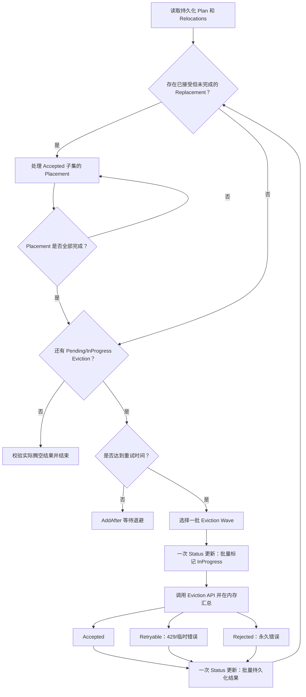

建议采用“批量驱逐 Wave \+ 成功子集 Placement \+ 失败子集退避重试”的执行模型。它不修改碎片整理规划算法、不解析 PDB，只调整 Execute 状态机。

## **1\. 设计目标**

需要同时满足：

* DryRun 和规划算法完全不感知 PDB。  
* Eviction API 始终作为 PDB 的最终裁决者。  
* 一轮可以提交多个 Pod，保证执行效率。  
* 不按 Pod 频繁更新 `RepackRun.status`。  
* 驱逐成功的 Pod 立即处理 replacement。  
* PDB 临时拒绝的 Pod 保留在原计划中，退避后重试。  
* 控制器重启后不会重复驱逐 replacement。  
* PDB 永久不开放时能够最终收敛，而不是无限重试。

非目标：

* 不预估 `disruptsionsAllowed`。  
* 不解析 PDB selector。  
* 不保证一轮计划原子执行；Kubernetes Eviction 本身也不支持批量事务。  
* 不绕过 PDB。

---

## **2\. 总体执行流程**

核心优先级是：

Placement 已成功驱逐的 Pod  
    \>  
提交下一轮 Eviction  
    \>  
最终结果校验

这样出现 PDB 429 后，已经成功驱逐的 Pod 可以先恢复，PDB allowance 随后才有机会恢复。

---

## **3\. Eviction Wave 定义**

一轮 Wave 包含当前满足以下条件的 relocation：

* `Eviction.Phase` 为 `Pending` 或 `InProgress`；  
* 尚未超过执行重试期限；  
* 当前退避时间已经到期；  
* 原 victim 没有被确认删除或替换。

第一版建议把当前所有到期的 relocation 都放入 Wave，Eviction API 调用保持顺序执行。性能瓶颈主要是 status 更新，不是这些必要的 API 请求。

如果后续 Pod 数量很大，可以再增加：

* 内部固定 `maxWaveSize`，例如 32 或 64；  
* Eviction API 小并发，例如 4；  
* 不需要暴露到 CRD。

顺序执行的优点是对 apiserver 和 PDB controller 压力更小，接受哪些 Pod 也更稳定。

---

## **4\. Wave 内部算法**

伪代码如下：

func executeEvictionWave(run \*RepackRun) error {  
    wave := collectDueEvictions(run)  
    if len(wave) \== 0 {  
        scheduleNextRetry(run)  
        return nil  
    }

    // 第一道持久化屏障。  
    // Pending 批量变成 InProgress；已经是 InProgress 的重试项不需要重复写。  
    if markWaveInProgress(run, wave) {  
        updateStatus(run) // 整个 Wave 一次  
    }

    result := waveResult{}

    for \_, victim := range wave {  
        pod := getCurrentPod(victim)

        switch observeOriginalPod(pod, victim.VictimPodUID) {  
        case OriginalGoneOrTerminating:  
            result.acceptedOrIndirect \= append(...)  
            continue  
        case ReplacementAlreadyExists:  
            result.indirectlyRemoved \= append(...)  
            continue  
        }

        err := evictWithUIDPrecondition(pod)

        switch classifyEvictionError(err) {  
        case Accepted:  
            result.accepted \= append(...)  
        case Retryable:  
            result.retryable \= append(...)  
        case Permanent:  
            result.rejected \= append(...)  
        }  
    }

    // 一次性写入整个 Wave 的结果。  
    applyWaveResult(run, result)  
    updateStatus(run)

    if len(result.accepted)+len(result.indirectlyRemoved) \> 0 {  
        transitionToPlacement(run)  
        enqueueImmediately(run)  
    } else if len(result.retryable) \> 0 {  
        scheduleWithBackoff(run)  
    } else {  
        enqueueImmediately(run)  
    }

    return nil  
}  
---

## **5\. Eviction 结果分类**

建议增加内部类型，不需要修改 CRD：

type evictionAttemptResult int

const (  
    evictionAccepted evictionAttemptResult \= iota  
    evictionRetryable  
    evictionPermanentFailure  
    evictionVictimGone  
)

分类建议如下：

| API 结果 | 内部结果 | 状态处理 |
| ----- | ----- | ----- |
| `nil` | Accepted | `Accepted` |
| `IsTooManyRequests` | Retryable | 保持 `InProgress` |
| timeout/server timeout | Retryable | 保持 `InProgress` |
| 503/服务暂时不可用 | Retryable | 保持 `InProgress` |
| 网络结果不确定 | Retryable | 下次先 GET 原 UID |
| 404 | Gone/恢复分类 | 按现有逻辑处理 |
| Pod UID 已变化 | Gone/Indirect | 不驱逐新 Pod |
| 403 | Permanent | `Rejected` |
| 422/请求非法 | Permanent | `Rejected` |

`429` 不必强行认定一定来自 PDB。它也可能来自 apiserver 限流，但两者都适合退避重试。

---

## **6\. Relocation 状态语义**

第一版不需要新增 `Retrying` 或 `Blocked` 枚举，可以复用现有状态：

Pending  
  → InProgress  
      → Accepted  
      → IndirectlyRemoved  
      → Rejected

其中 `InProgress` 扩展语义为：

> 驱逐意图已经持久化；Eviction API 可能已经调用，或者正在等待临时失败后的重试。

当前定义本来就允许控制器恢复时重新观察 Pod UID，因此与重试语义兼容。

建议 Message：

Pending:  
  Eviction has not been attempted.

InProgress:  
  Eviction intent is durable; the request may be submitted or retried.

Accepted:  
  Eviction API accepted the victim.

Rejected:  
  Eviction permanently failed or exceeded the retry deadline.

PDB 429 的具体错误可以在本轮结果 checkpoint 中批量写入：

Eviction temporarily blocked; retry scheduled.

不需要每次重试都刷新 message。

---

## **7\. Status 更新优化**

当前每个 Pod 都会：

1. 写一次 `InProgress`  
2. 调用 Eviction API  
3. 再写一次 Accepted/Rejected

N 个 Pod 大约需要 `2N` 次 status 更新。

建议改为 Wave 级 checkpoint。

### **第一次执行 Wave**

一次更新：Wave 内所有 Pending → InProgress  
调用全部 Eviction API  
一次更新：批量写入 Accepted/Retryable/Rejected

无论 Wave 有多少 Pod，固定约两次 status 更新。

### **后续重试 Wave**

Retryable Pod 已经是 `InProgress`：

* 不需要再次持久化 intent；  
* 如果仍然全部返回相同的 429，phase 和 message 都没变化，可以完全不更新 status；  
* 只记录日志、metrics，并重新 `AddAfter`；  
* 当某个 Pod 变成 Accepted 或达到 deadline 时，再更新一次 status。

因此稳定 PDB 阻塞期间可以做到：

0 次 status 更新 / retry

### **Status 只在这些情况更新**

* 首次 Wave：`Pending → InProgress`  
* 本轮出现新的 Accepted  
* 本轮出现永久 Rejected  
* 首次进入“部分阻塞”状态  
* Accepted replacement 状态发生变化  
* 重试期限到达  
* 最终结果发生变化

事件也应聚合，避免每次重试都产生 Kubernetes Event。

---

## **8\. Status 合并逻辑调整**

当前 `mergeRelocationProgress` 在 eviction phase 相同时会保留服务端旧 Message。这会导致：

InProgress: intent persisted

无法更新成：

InProgress: temporarily blocked

因为 Eviction journal 明确由 engine 单独负责，建议调整为：

* 服务端 phase 比本地更新更晚：保留服务端 phase/message；  
* phase 相同：使用本次 engine 写入的 message；  
* placement 字段仍然保留 placement controller 的最新进度。

即：

if persistedPhase \!= desiredPhase &&  
    evictionPhaseAdvances(desiredPhase, persistedPhase) {  
    preservePersistedEviction()  
}  
// phase 相同时，desired eviction message 胜出

这样不会覆盖 placement controller 管理的 `Placement` 字段。

---

## **9\. Replacement 协调**

这是方案能否真正实现滚动迁移的关键。

本轮 Eviction 完成后：

* Accepted/IndirectlyRemoved：允许参与 replacement matching 和 placement；  
* InProgress：继续保持 lease，但不能认领 replacement；  
* Rejected：不能认领 replacement。

已有的 `EvictionAllowsPlacement` 已经满足这个判断：

\[placement.go (line 102)\](/Users/wangyang/Code/github-wangyang0616/volcano.sh/volcano/staging/src/volcano.sh/repack-controller/pkg/placement/placement.go:102)

需要修改的是 engine 的 action 优先级。当前只要存在 `Pending/InProgress`，`isEvictionCandidate` 就会优先继续 eviction：

\[repackengine.go (line 303)\](/Users/wangyang/Code/github-wangyang0616/volcano.sh/volcano/pkg/repackengine/repackengine.go:303)

建议改为统一的执行动作判断：

type executeAction int

const (  
    executePlacement executeAction \= iota  
    executeEviction  
    executeWait  
    executeFinalize  
)

选择逻辑：

func nextExecuteAction(run \*RepackRun) executeAction {  
    if hasAcceptedPlacementWork(run) {  
        return executePlacement  
    }  
    if hasDueRetryableEvictions(run) {  
        return executeEviction  
    }  
    if hasRetryableEvictions(run) {  
        return executeWait  
    }  
    return executeFinalize  
}

不能再让 `isEvictionCandidate` 单纯因为存在 `InProgress` 就压过 placement。

---

## **10\. Placement 完成判断**

当前 `placementsComplete` 会检查所有 relocation：

\[placement.go (line 634)\](/Users/wangyang/Code/github-wangyang0616/volcano.sh/volcano/pkg/repackengine/placement.go:634)

在新模型中，PDB blocked relocation 仍然处于：

Eviction=InProgress  
Placement=WaitingForReplacement

如果继续检查全部 relocation，当前成功子集的 placement 永远无法完成。

需要改成只检查：

Eviction.Phase \== Accepted ||  
Eviction.Phase \== IndirectlyRemoved

例如：

func committedPlacementsComplete(run \*RepackRun) bool {  
    found := false  
    for i := range run.Status.Relocations {  
        r := \&run.Status.Relocations\[i\]  
        if \!placement.EvictionAllowsPlacement(r) {  
            continue  
        }  
        found \= true  
        switch r.Placement.Phase {  
        case Placed, TimedOut:  
        default:  
            return false  
        }  
    }  
    return found  
}

当本轮 Accepted replacement 全部 `Placed` 后：

* 如果还有 `Pending/InProgress` eviction，返回 Evicting；  
* 如果没有剩余 eviction，才进入最终结果校验。

如果 Accepted replacement 出现 `TimedOut`，建议停止后续 eviction，避免在已无法恢复当前 workload 的情况下继续扩大扰动。

---

## **11\. Placement ExpirationTime**

当前所有 relocation 的 `ExpirationTime` 在计划准备阶段统一生成：

\[status.go (line 609)\](/Users/wangyang/Code/github-wangyang0616/volcano.sh/volcano/pkg/repackengine/status.go:609)

引入 PDB 重试后，后面的 victim 可能等待很久才驱逐。它真正产生 replacement 时，原来的 placement deadline 可能已经过期。

因此，在 Eviction 从 `InProgress` 变为 `Accepted` 时，应刷新：

relocation.Placement.ExpirationTime \=  
    now \+ NominationTTL

这个修改可以和 Wave outcome 一起写入，不增加 status 更新次数。

如果控制器在 Eviction API 成功之后、写 Accepted 之前崩溃：

* 恢复时发现原 Pod 已删除或 Terminating；  
* 将其恢复为 Accepted；  
* 同时重新设置完整的 placement TTL。

---

## **12\. 退避策略**

建议使用每个 relocation 的内存退避状态：

type evictionRetryState struct {  
    attempts int  
    nextTime time.Time  
}

退避计算：

1s → 2s → 4s → 8s → 16s → 30s

并增加 ±20% jitter。

特点：

* 不把 `attempts` 和 `nextRetryTime` 写进 CRD；  
* 不产生额外 status 写入；  
* engine 重启后退避状态丢失，只会立即多重试一次；  
* Pod UID 前置条件和 Eviction API 可以保证安全。

整个 Run 只有一个 Execute worker，可以取所有 retryable relocation 中最早的 `nextTime`：

workQueue.AddAfter(run.Name, earliestNextTime.Sub(now))

不要在 reconcile 中使用 `sleep`。

---

## **13\. 重试期限**

结合当前代码，`RepackRunSpec` 没有 `activeDeadlineSeconds`，目前只有 eviction 的 `gracePeriodSeconds`：

\[repackrun\_types.go (line 137)\](/Users/wangyang/Code/github-wangyang0616/volcano.sh/volcano/staging/src/volcano.sh/apis/pkg/apis/repack/v1alpha1/repackrun\_types.go:137)

建议不扩展 CRD，增加 engine 级配置：

\--repack-eviction-retry-timeout=10m

对应：

Config.EvictionRetryTimeout time.Duration

deadline 可以重启后稳定推导：

retryDeadline \=  
    run.Status.StartTime \+ EvictionRetryTimeout

达到期限后：

* 剩余 `Pending/InProgress` 标记为 `Rejected`；  
* Message 记录重试超时；  
* 已经 Accepted 的 replacement 必须完成或释放 gate；  
* 再进行实际腾空结果校验；  
* 不继续驱逐新的 Pod。

不建议直接复用 `NominationTTL`，因为：

* Eviction retry timeout 控制等待 PDB 的时间；  
* NominationTTL 控制 replacement placement 时间；

两者语义不同。

---

## **14\. Placement Lease 生命周期**

需要保留以下规则：

* 只要 PodGroup 中还有 Pending/InProgress eviction，placement lease 必须保留；  
* Accepted replacement 完成后，如果同一 PodGroup 还有 retryable victim，也不能释放 lease；  
* 永久 Rejected 且同组没有其他未完成 relocation 时，可以释放 lease；  
* Run 终态必须清理所有自己持有的 lease；  
* lease owner 仍使用 `Run name + UID`，避免误删新 Run 的 lease。

当前 `placementPodGroups(run)` 会遍历全部 relocation，因此只要不提前删除 retryable relocation，lease 就可以自然保留。

---

## **15\. 终态判断**

只有满足以下条件才能进入最终状态：

不存在 Pending/InProgress Eviction  
并且  
所有 Accepted/IndirectlyRemoved Replacement 都已 Placed 或 TimedOut

之后再计算：

* 实际接受的 eviction 数量；  
* 实际 replacement 数量；  
* 实际腾空节点；  
* 实际碎片率；  
* `MetricsVerified`。

以下情况不能提前终态：

* 所有本轮 Eviction 都返回 429，但 retry deadline 未到；  
* 部分成功、部分 retryable；  
* Accepted replacement 还没有完成 placement。

如果 deadline 到期后计划只执行了一部分，继续沿用现有结果语义：

* Plan 保持完整、不可修改；  
* Result 只统计实际成功部分；  
* 未实现计划收益时以 `EvictionFailed` 或 `BenefitNotRealized` 结束。

---

## **16\. Crash Recovery**

现有 per-Pod journal 和 UID precondition 可以继续使用，不需要增加 Wave ID。

| 崩溃位置 | 恢复行为 |
| ----- | ----- |
| Wave intent 写入前 | Pod 仍为 Pending，重新选择 |
| intent 写入后、API 调用前 | InProgress，GET 原 Pod，安全重试 |
| API 成功后、结果写入前 | 原 Pod 已 Terminating/消失，恢复为 Accepted |
| PDB 429 后、结果写入前 | 原 Pod 仍存在，重新重试 |
| Accepted 写入后、placement 前 | `nextExecuteAction` 优先恢复 placement |
| placement 完成后、剩余 eviction 前 | 根据 journal 自动回到 Eviction |
| outcome status 冲突 | 批量 `RetryOnConflict`，同时保留 controller 的 placement 进度 |

不需要持久化当前 Wave 编号，因为所有动作都可以由 relocation phase 推导。

---

## **17\. 对现有代码的改造点**

### **`pkg/repackengine/eviction.go`**

* 将当前逐 Pod `persistEvictionOutcome` 改为 Wave checkpoint。  
* 新增：  
  * `collectEvictionWave`  
  * `markEvictionWaveInProgress`  
  * `executeEvictionWave`  
  * `classifyEvictionError`  
  * `applyEvictionWaveResult`  
  * `scheduleEvictionRetry`  
* Retryable 不再设置 `Rejected`。  
* 存在 retryable 时不调用当前的失败收口。  
* 不在 placement 前删除 retryable relocation。

### **`pkg/repackengine/repackengine.go`**

* 用 `nextExecuteAction` 替换 eviction 优先的候选判断。  
* Accepted placement 优先于剩余 eviction。  
* 支持 `Wait` 动作，仅执行 `AddAfter`。

### **`pkg/repackengine/placement.go`**

* placement 只处理 Accepted/IndirectlyRemoved。  
* `placementsComplete` 改为 accepted subset 语义。  
* 本轮 placement 完成后，如果还有 retryable eviction，回到 Evicting，而不是调用最终 `finishPlacement`。  
* placement TimedOut 时停止扩大驱逐。  
* Eviction accepted 时刷新 placement expiration。

### **`pkg/repackengine/status.go`**

* 保持 eviction phase 单向推进。  
* 同 phase 时允许 engine 更新 eviction message。  
* 继续保留 placement controller 的更新，避免 status 冲突覆盖。  
* Plan 始终不可修改。

### **启动配置**

增加：

\--repack-eviction-retry-timeout

退避初始值、最大值和 jitter 第一版可以作为内部常量，避免暴露过多配置。

---

## **18\. 日志、事件和 Metrics**

建议日志按 Wave 聚合：

waveSize=10  
accepted=6  
retryable=3  
rejected=1  
nextRetryAfter=8s

事件只在以下时机产生：

* 首次出现临时 Eviction 阻塞；  
* 阻塞后首次恢复成功；  
* retry deadline 到期；  
* Wave 出现永久失败；  
* Run 最终完成。

Metrics 建议区分“API 尝试”和“最终 relocation 结果”：

repack\_eviction\_attempts\_total{  
  result="accepted|too\_many\_requests|transient\_error|permanent\_error"  
}

repack\_eviction\_waves\_total{  
  outcome="complete|partial|blocked"  
}

repack\_eviction\_retry\_delay\_seconds

`too_many_requests` 是尝试次数，可能同一个 Pod累计多次；最终 `evictions_total` 仍然只在 phase 进入终态时计一次。

---

## **19\. 测试方案**

### **单元测试**

1. 10 个 Pod 的 Wave 只产生两次 status checkpoint。  
2. 3 Accepted \+ 2 PDB 429：  
   * Accepted 进入 placement；  
   * 429 保持 InProgress；  
   * Run 不终态。  
3. 全部 429：  
   * 不进入 Failed；  
   * 调用 `AddAfter`；  
   * 重复 429 不更新 status。  
4. 429 后下一次 Accepted：  
   * phase 单向进入 Accepted；  
   * placement TTL 被刷新。  
5. Accepted placement 完成后自动返回 eviction。  
6. replacement TimedOut 后不继续驱逐剩余 Pod。  
7. 403 直接 Rejected，不重试。  
8. retry timeout 后剩余 InProgress 转 Rejected。  
9. crash after intent：  
   * 原 Pod 存在则重试。  
10. crash after Eviction success：  
    * 原 Pod Terminating/不存在则恢复 Accepted。  
11. status conflict：  
    * engine eviction 更新不覆盖 controller placement 更新。  
12. 同 PodGroup 中 Accepted、InProgress 混合时 lease 不提前释放。

### **E2E**

1. Deployment 两个 victim，PDB `maxUnavailable: 1`：  
   * 第一批部分成功；  
   * replacement 恢复；  
   * 剩余 Pod 后续驱逐成功；  
   * 最终节点腾空。  
2. PDB `maxUnavailable: 0`：  
   * Run 保持 Running 并退避；  
   * deadline 后失败；  
   * 没有绕过 PDB。  
3. 一个受 PDB 保护、一个不受保护：  
   * 未保护 Pod 先成功并完成 replacement；  
   * 受保护 Pod 后续重试。  
4. blocked 状态下重启 repack-engine：  
   * 恢复后不误驱逐 replacement；  
   * 继续重试原 UID。  
5. replacement 长时间 Pending：  
   * 不继续扩大驱逐；  
   * placement timeout 后安全释放 gate。

---

## **20\. 推荐落地顺序**

第一阶段完成最小闭环：

1. 识别 429/临时错误为 Retryable。  
2. Wave 级 status checkpoint。  
3. retryable 保持 `InProgress`。  
4. Accepted replacement 优先处理。  
5. placement 完成后返回 eviction。  
6. 增加退避和全局 retry timeout。  
7. 修正 accepted subset 的 placement 完成判断。

第二阶段再做性能增强：

* Wave size 限制；  
* Eviction API 有限并发；  
* 更细的 metrics；  
* 聚合事件和日志；  
* 提前释放已经彻底完成且没有 retryable 的 PodGroup lease。

这套方案不增加 PDB 与碎片整理算法的组合复杂度，同时能够让 `maxUnavailable: 1` 一类工作负载按 Wave 逐步恢复并最终完成节点腾空。

