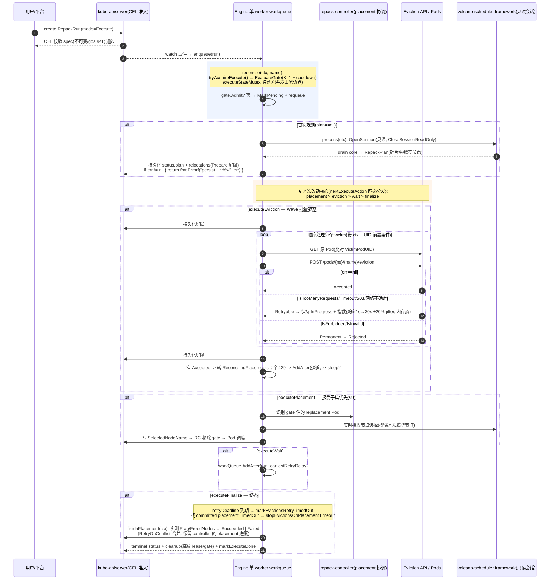

我先以 Go 技术负责人视角自动探查实际变更（用 git 状态作为权威依据），再输出交付总结。

Ran terminal command:  git status --short 2>/dev/null | head -40

Ran terminal command:  git diff --stat 2>/dev/null | tail -25 && echo "---" && git diff --name-only 2>/dev/null | grep -E "go.mod|go.sum" || echo "go.mod/go.sum 无改动"

确认关键符号的最终形态（函数清单、指标/事件名、配置项），确保评审内容准确。

Searched for regex `^func |^type |^const |^var ` (`**/pkg/repackengine/eviction_wave.go`), 36 results

Searched for regex `executePlacement|executeEviction|executeWait|executeFinalize|EvictionRetryTimeout|evictionRetryStates|evictionBlocked` (`**/pkg/repackengine/repackengine.go`), 13 results

以下变更清单基于 `git status`/`git diff --stat` 的权威探查结果（**18 个修改文件 + 3 个新增 Go 文件 + 1 个新增设计文档**，`go.mod/go.sum` 无改动）。

---

## 二、业务全链路（Critical Path）—— Mermaid 序列图



---

## 一、Go 文件改动全景图

> 说明：本仓库是 Volcano（Kubernetes 调度器）分叉，**无 `internal/`、`handler/service/repo/entity`、`migrations/` 等 Web 分层**。按 Go 标准项目布局实际映射为：`cmd`（进程入口）→ `pkg`（内部库，"服务"层）→ `staging`（本地依赖 API 仓库）→ `e2e`（集成测试）→ `installer`（部署清单，承担"配置/迁移"角色）。

### `cmd` —— 进程入口
| 文件 | 改动目的 |
|---|---|
| `options.go` | 新增 `ServerOption.EvictionRetryTimeout` 字段与 `--repack-eviction-retry-timeout` flag（默认 `10m`），`AddFlags` 绑定 |
| `server.go` | 把新 flag 透传给 `repackengine.Config{EvictionRetryTimeout: ...}` |

### `repackengine` —— 核心服务层（本次改动最大的 Service 方法）
| 文件 | 改动目的 |
|---|---|
| `eviction_wave.go` **（新增，约 690 行）** | Wave 驱逐状态机核心：`executeEvictionWave(WithClient)`（两段式持久化屏障）、`collectEvictionWave`、`markEvictionWaveInProgress`、`executeWaveVictim`、`classifyEvictionError`（§5 分类表）、`applyEvictionWaveResult`（含 §11 TTL 刷新）、`recordEvictionRetry`/`nextDueEviction`/`scheduleEvictionRetry`（内存退避）、`nextExecuteAction` 四态分发、`committedPlacementsComplete` 等纯状态函数 |
| `repackengine.go` | `Config`/`Engine` 新增 `EvictionRetryTimeout`、`evictionRetryStates`、`evictionBlocked`；`reconcile` 由 eviction/placement 二分改为 `nextExecuteAction` 四态分发（含 `executeFinalize` 的全拒/超时收尾）；`isEvictionCandidate`/`isPlacementCandidate` 收敛为 `isExecutionCandidate` |
| `eviction.go` | 删除旧 per-Pod 全量提交 `executePreparedEvictions*`/`persistEvictionOutcome`（-200 行），保留 `plannedVictims`/`classifyMissingVictims` 等纯 helper |
| `placement.go` | `placementsComplete` → `committedPlacementsComplete`（接受子集语义）；placement 完成后有 retryable 则**回到 eviction**；`expirePlacements` 仅处理 committed；`finishPlacement` 顶部 `retainSuccessfulRelocations`+`initializeExecuteResultFromStatus` |
| `status.go` | `mergeRelocationProgress` 同 phase 时 engine 的 eviction message 胜出（§8）；`realizedFreedNodeNames` 仅统计 committed relocation |
| `process.go` | 首波入口由 `executePreparedEvictions` 切到 `executeEvictionWave`（1 行） |
| `gate.go` | `markExecuteDone` 终态时清理 `evictionRetryStates`/`evictionBlocked` 内存态 |
| `events.go` | 新增事件 reason：`EvictionBlocked`/`EvictionUnblocked`/`EvictionRetryTimedOut` |
| `metrics/metrics.go` | 新增 `eviction_attempts_total`/`eviction_waves_total`/`eviction_retry_delay_seconds` 及 observer |

### `repackengine` —— 单元测试
| 文件 | 改动目的 |
|---|---|
| `eviction_wave_test.go` **（新增）** | 8 组用例：`classifyEvictionError` 分类表、`nextExecuteAction` 优先级、退避收集、部分接受路由、TTL 刷新、deadline 拒绝、`stopEvictionsOnPlacementTimeout`、committed 子集 |
| `eviction_test.go` | 删除引用已移除函数的旧恢复用例（-151 行），保留 `classifyMissingVictims` 用例 |
| `placement_test.go` / `status_test.go` | 既有 fixture 补 `Eviction: Accepted`（适配 committed 语义，各 +9/+6 行） |

### `repack` —— E2E/集成测试
| 文件 | 改动目的 |
|---|---|
| `pdb_retry.go` **（新增）** | `Describe("Repack PDB retry & backoff")`：E2E-1（maxUnavailable=1 波次滚动）、E2E-3（受保护/未受保护顺序）、E2E-4（阻塞期间引擎重启恢复）、E2E-5（placement 挂起不扩大驱逐+超时放行 gate） |
| `execute_lifecycle.go` | 两个既有 PDB 测试按新语义重写（全阻塞=退避后 `EvictionFailed`；部分拒绝=`BenefitNotRealized`） |
| `repack_helpers.go` | 新增 `withEvictionRetryTimeout`（运行时热改引擎 retry-timeout 并滚动重启/还原）、`waitForRepackEngineRollout`、`runningPodsForJob`、`podStillRunningWithUID` |

### `installer` —— 部署/配置（对应"配置变更"章节）
| 文件 | 改动目的 |
|---|---|
| `repack.yaml` | engine args 增加 `--repack-eviction-retry-timeout={{ .Values.custom.repack_eviction_retry_timeout }}` |
| `values.yaml` | 新增 `repack_eviction_retry_timeout: "10m"` |
| `repack-engine.yaml` | 独立清单 args 增加 `--repack-eviction-retry-timeout=10m` |

### 未改动（供确认）
`apis`、`repack-controller`（Wave 模型只**消费**其既有 `placement.EvictionAllowsPlacement` 接口，未改其源码）；`crd` 下 RepackRun CRD **零改动**。

---

## 二、修改后的业务全链路（Critical Path）说明

（序列图见文首）本次改动最大的 Service 层方法是 **`repackengine` 的 `executeEvictionWave` + `nextExecuteAction`**，关键 Go 惯用法：

1. **上下文贯穿**：`process(ctx)` → `reconcile(ctx, name)` → `executeEvictionWave(ctx, run, gen, res)` → `executeWaveVictim(ctx, ...)` → `kubernetesClient.CoreV1().Pods(ns).Get(ctx, ...)`，全链路 `context.Context` 显式传递。
2. **错误向上抛出**（关键节点均为 `%w` 包装）：
   ```go
   if err := e.updateStatus(ctx, run); err != nil {
       return fmt.Errorf("persist eviction wave outcome: %w", err)   // 屏障#2
   }
   return e.fail(ctx, work, work.Generation, state.ReasonEvictionFailed,
       fmt.Errorf("all %d planned evictions were rejected or timed out; no Pods were moved", ...))
   ```
   `isTerminalStatusPersistenceError`/`apierrors.IsConflict` 区分"可重试的状态写失败"与"真实失败"，避免吞掉 poison-pill 预算。
3. **事务/一致性边界**（本项目无 DB，对应物为三类）：
   - **两段式持久化屏障**：整波 `Pending→InProgress` 一次写 + 整波结果一次写（稳定 429 期间 0 写），保证"先持久化意图、再发 API、崩溃可恢复"；
   - **并发临界区**：`executeStateMutex` 保护 K=1 串行门（`tryAcquireExecute` 单临界区 check+claim）；
   - **冲突合并**：`writeStatus` 内 `RetryOnConflict` + `mergeRelocationProgress`，保留 controller 的 placement 进度不被 engine 的 eviction 写覆盖。

---

## 三、Go 测试覆盖策略

> ⚠️ 该仓库**不使用** `gomock`/`mockery`/`testify`/`testcontainers`/`dockertest`，而是 Volcano 生态的标准做法，如实说明如下。

**单元测试（`pkg/repackengine/*_test.go`）**
- **隔离方式**：`k8s.io/client-go/kubernetes/fake` + `volcano.sh/apis/pkg/client/clientset/versioned/fake`（fake clientset），用 `PrependReactor("create","pods",...)` 注入 Eviction API 的 429/成功响应；`now func() time.Time` 注入时间；`record.NewFakeRecorder` 捕获事件。**无 mock 框架**，靠接口注入（`executeEvictionWaveWithClient(ctx,..., kubernetesClient)` 可测试变体）。
- **断言策略**：`testing` 原生 + 表驱动（`classifyEvictionError` 9 行表），状态机用例直接断言 phase 迁移；退避用 ±20% jitter 的**区间断言**（`retryAfter ∈ (0, 2s]`）。
- **覆盖分支**：分类表 9 项、placement/eviction/wait/finalize 四态、deadline 拒绝、placement 超时停驱逐、TTL 刷新、committed 子集、崩溃恢复语义。

**E2E/集成测试（`repack`）**
- **真实依赖**：无容器拉起工具；在 **kind 集群**（`E2E_TYPE=REPACK`，helm 部署真实 repack-engine/controller/webhook）上跑，用**假扩展资源** `volcano.sh/e2e-npu` 在节点上模拟 GPU/NPU。
- **覆盖场景（对应方案 §19）**：
  - 状态码路径：Eviction API `Accepted`（成功）、`429`（Retryable → InProgress）、PDB `maxUnavailable:0`（最终 `EvictionFailed`）、`maxUnavailable:1`（波次滚动成功 `ExecutionCompleted`）；
  - 业务异常分支：部分 PDB 拒绝（`BenefitNotRealized`）、placement 无落点超时（`PlacementTimedOut` + gate 释放）、引擎重启恢复（UID 防重复驱逐）、不扩大驱逐（victim 全程存活）。
- **新基建**：`withEvictionRetryTimeout` 在用例内把引擎 `--repack-eviction-retry-timeout` 缩短到 20–60s 并在 `DeferCleanup` 还原（否则 10m 默认值超出测试窗口）。

**验证结果**：`go test ./pkg/repackengine/` 全绿；`go vet ./test/e2e/repack/` 通过；`go build `cmd`.` 通过；`gofmt` 干净。

---

## 四、Go 项目变更影响清单（运维/部署关注）

| 类别 | 结论 |
|---|---|
| **依赖变更（go.mod）** | ❌ **无**。`git diff --name-only` 确认 `go.mod`/`go.sum` 未改动；Wave 模型仅消费既有 `volcano.sh/apis`、`volcano.sh/repack-controller`（staging 本地模块）。无第三方库新增 |
| **配置变更** | ✅ 新增 engine flag：`--repack-eviction-retry-timeout`（默认 `10m`，旧二进制缺省即 10m → **向后兼容**）；helm `values.yaml` 新增 `custom.repack_eviction_retry_timeout`；`repack-engine.yaml` args 同步 |
| **数据库（DDL/migrations）** | ❌ 无。本项目无数据库、无 `migrations/` 目录；CRD（`config/crd/.../repackruns.yaml`）**零 schema 变更**（设计约束：不新增枚举/字段） |
| **API 兼容性** | ⚠️ **无破坏性变更**：REST/CRD 协议不变。但存在**状态语义变化**（需知会下游）：① Eviction 失败时 `status.relocations` 不再被清空，而是保留 `Rejected` 记录（审计性增强）；② 全阻塞下 Run 由"立即 Failed"变为"退避后按 retry deadline Failed"（行为时延变化）；③ 部分 PDB 拒绝的终态 reason 由 `EvictionFailed` 变为 `BenefitNotRealized`。监控告警若按旧 reason 匹配需同步 |

**部署建议**：升级需同时替换 `volcano-repack-engine` 镜像（含新 flag）；`--repack-eviction-retry-timeout` 建议按"PDB 可接受的最大驱逐等待"配置（默认 10m 与 cooldown 一致）；其余组件（scheduler/controller/webhook）无需改动。

---

## 差异备忘（此前代码方案 vs 实际落地）

以下为**实际落地代码**与最初"代码方案"之间的有意调整，均已在编译/单测/E2E 中验证，**无结构体字段不一致**：

1. **`nextExecuteAction` 判定顺序**：原方案把 `committedPlacementTimedOut` 放在 `hasAcceptedPlacementWork` 分支内部；落地版提升到 `switch` 首位——否则 TimedOut 的 committed 会令 `hasAcceptedPlacementWork` 返回 false，误入 `executeEviction` 继续驱逐（E2E-5 相关推演发现）。
2. **`markEvictionsRetryTimedOut` 重构**：原方案为单函数（含事件）；落地拆为底座 `rejectUnfinishedEvictions(ctx, run, message)` + deadline 场景 `markEvictionsRetryTimedOut` + 新增 **`stopEvictionsOnPlacementTimeout`**（修复 E2E-5 暴露的"placement 超时后 executeFinalize 报错死循环"缺口）。
3. **`executeFinalize` 扩展**：原方案只处理 retryDeadline 到期；落地新增 `committedPlacementTimedOut` 停止驱逐分支，并在全拒路径补 `initializeExecuteResultFromStatus`（保证 `Result` 非 nil、`MetricsVerified=false` 可观测）。
4. **`EvictionBlocked` 事件触发条件**：原方案仅"全波 429"触发；落地改为**任何含 retryable 的波**（含部分接受）都触发首次阻塞、首次清空触发恢复（§18，E2E-1 验证需要）。
5. **E2E 侧**：原方案无引擎参数热改助手；落地新增 `withEvictionRetryTimeout`；E2E-4 的 victim 断言由"固定 jobA"改为"对全部 relocation 的 `VictimPodUID` 集合断言"（规避 drain 目标不确定导致的偶发失败）。